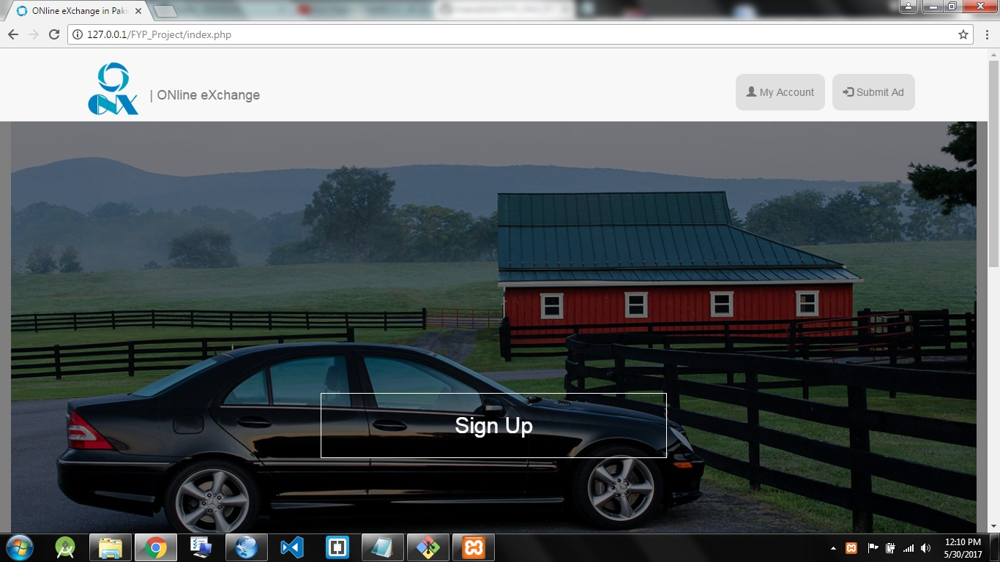
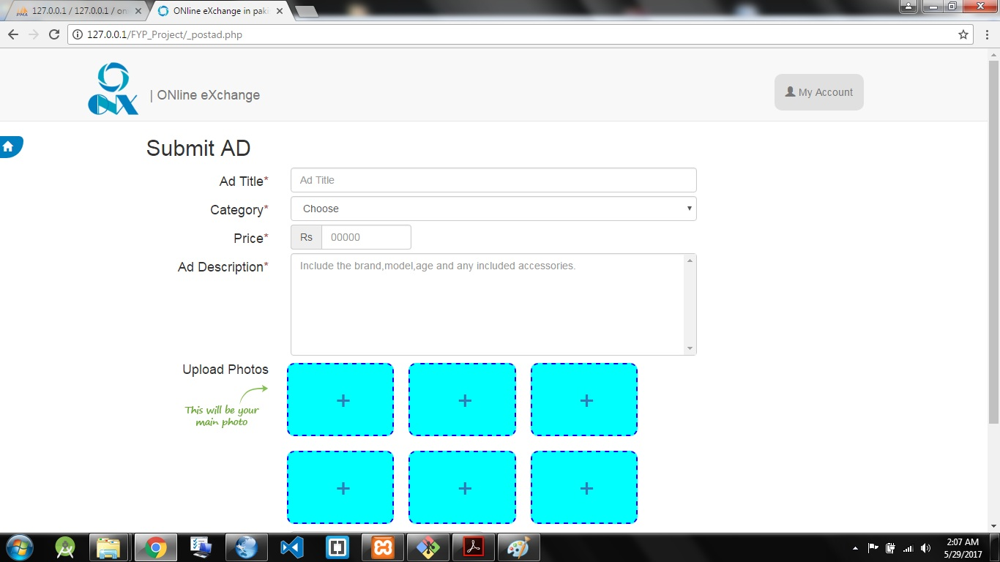
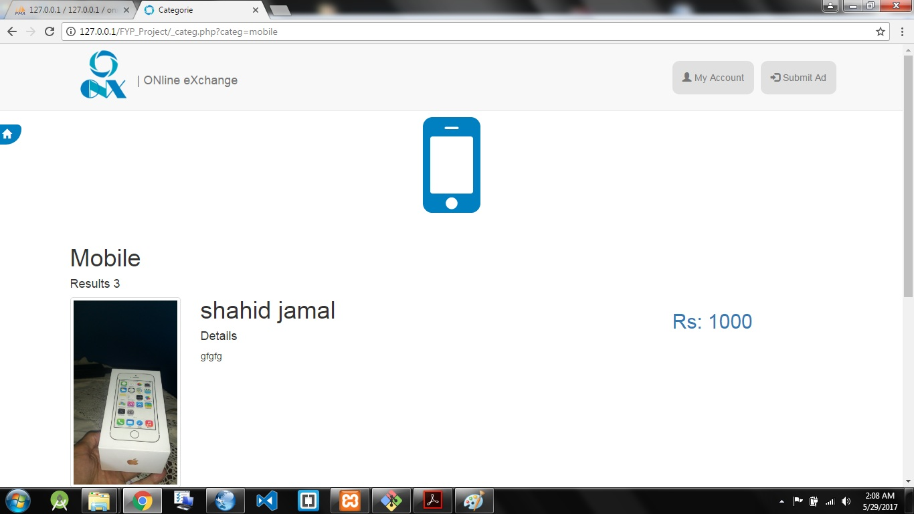
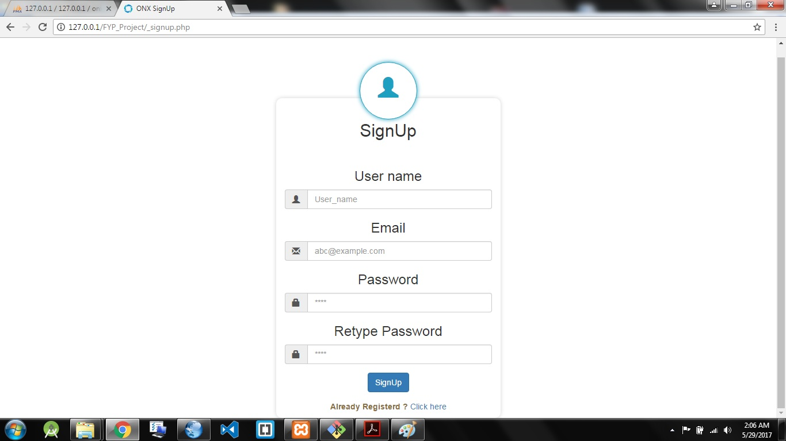
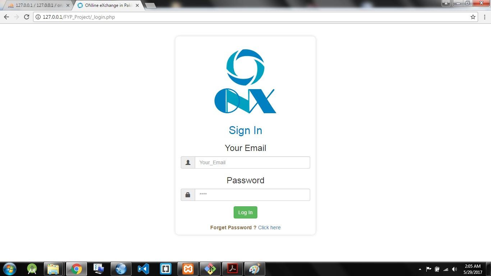
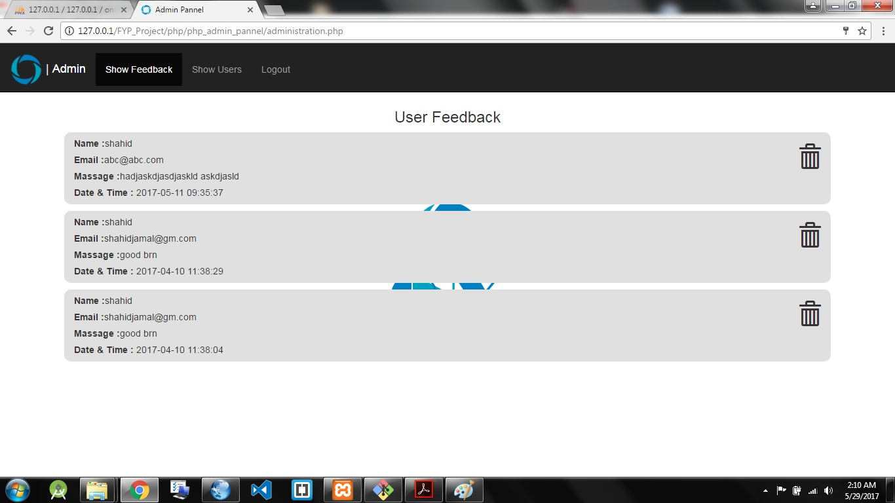

# ONX ONline eXchange

## ONX is a web base dynamic application.
## This is B2C and C2C base E-Commerce Website.
## Cross Browser Suported.
## Ad base website. 
### Post Ad.

### View Ad.

### Sign Up.

### Sign In.

## Feedback Receiving.

### Admin Pannel.

### Through Admin Pannel admin have authorize to delete Feedback and view users.

---------------------------------------------

# Technology Use For Building That Project

## FrontEnd

..* HTML5

..* CSS3

..* BOOTSTRAP

..* JAVASCRIPT

..* JQUERY

..*..* AJAX

..*..* JASON

## Server Side

..* PHP

..* Database

..* MySQl

